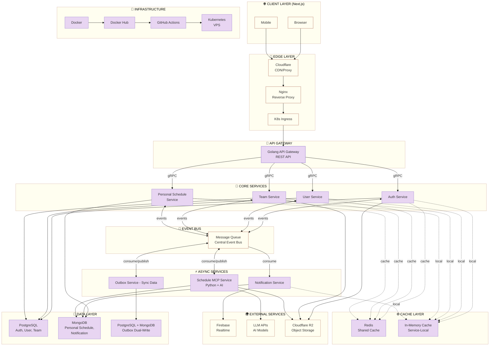

1. Context Diagram
1.1. Architecture Diagram
## Architecture Diagram

```mermaid
%%{init: {'flowchart': {'htmlLabels': true}, 'theme': 'base', 'themeVariables': { 'primaryColor': '#f5f5f5', 'primaryBorderColor': '#d0d0d0', 'background': '#f0f0f0', 'mainBkg': '#f5f5f5', 'clusterBkg': '#fffef0', 'clusterBorder': '#d4af9e'}}}%%
graph TD
    subgraph CLIENT ["🌐 CLIENT LAYER (Next.js)"]
        Browser["Browser"]
        Mobile["Mobile"]
    end

    subgraph EDGE ["🔗 EDGE LAYER"]
        CDN["Cloudflare<br/>CDN/Proxy"]
        Nginx["Nginx<br/>Reverse Proxy"]
        Ingress["K8s Ingress"]
    end

    subgraph APP ["📡 API GATEWAY"]
        APIGw["Golang API Gateway<br/>REST API"]
    end

    subgraph CORE ["🔐 CORE SERVICES"]
        AuthSvc["Auth Service"]
        UserSvc["User Service"]
        TeamSvc["Team Service"]
        ScheduleSvc["Personal Schedule<br/>Service"]
    end

    subgraph EVENT ["📨 EVENT BUS"]
        MQ["Message Queue<br/>Central Event Bus"]
    end

    subgraph ASYNC ["⚡ ASYNC SERVICES"]
        NotifSvc["Notification Service"]
        OutboxSvc["Outbox Service - Sync Data"]
        MCPSvc["Schedule MCP Service<br/>Python + AI"]
    end

    subgraph DATA ["💾 DATA LAYER"]
        PG["PostgreSQL<br/>Auth, User, Team"]
        MongoDB["MongoDB<br/>Personal Schedule,<br/>Notification"]
        MQData["PostgreSQL + MongoDB<br/>Outbox Dual-Write"]
    end

    subgraph CACHE ["⚙️ CACHE LAYER"]
        Redis["Redis<br/>Shared Cache"]
        InMemory["In-Memory Cache<br/>Service-Local"]
    end

    subgraph EXTERNAL ["🌍 EXTERNAL SERVICES"]
        Firebase["Firebase<br/>Realtime"]
        LLM["LLM APIs<br/>AI Models"]
        R2["Cloudflare R2<br/>Object Storage"]
    end

    subgraph INFRA ["🐳 INFRASTRUCTURE"]
        Docker["Docker"]
        Hub["Docker Hub"]
        Actions["GitHub Actions"]
        K8s["Kubernetes<br/>VPS"]
    end

    %% Client → Edge Flow
    Browser --> CDN
    Mobile --> CDN
    CDN --> Nginx
    Nginx --> Ingress
    Ingress --> APIGw

    %% API Gateway → Core Services
    APIGw -->|gRPC| AuthSvc
    APIGw -->|gRPC| UserSvc
    APIGw -->|gRPC| TeamSvc
    APIGw -->|gRPC| ScheduleSvc

    %% Core Services ↔ Message Queue (Bidirectional)
    AuthSvc <-->|events| MQ
    UserSvc <-->|events| MQ
    TeamSvc <-->|events| MQ
    ScheduleSvc <-->|events| MQ

    %% Message Queue → Async Services (1D for Notification)
    MQ -->|consume| NotifSvc
    MQ <-->|consume/publish| OutboxSvc
    MQ <-->|consume/publish| MCPSvc

    %% Data Access
    AuthSvc --> PG
    UserSvc --> PG
    TeamSvc --> PG
    ScheduleSvc --> MongoDB
    NotifSvc --> MongoDB
    OutboxSvc --> MQData
    MCPSvc --> MongoDB

    %% Cache Access
    AuthSvc -.->|cache| Redis
    UserSvc -.->|cache| Redis
    TeamSvc -.->|cache| Redis
    ScheduleSvc -.->|cache| Redis
    
    AuthSvc -.->|local| InMemory
    UserSvc -.->|local| InMemory
    TeamSvc -.->|local| InMemory
    ScheduleSvc -.->|local| InMemory
    NotifSvc -.->|local| InMemory

    %% External Services
    NotifSvc --> Firebase
    MCPSvc --> LLM
    AuthSvc --> R2
    TeamSvc --> R2
    MCPSvc --> R2

    %% Infrastructure
    Docker --> Hub
    Hub --> Actions
    Actions --> K8s

    %% Styling
    classDef clientStyle fill:#fffef0,stroke:#d4af9e,stroke-width:2px,color:#333333
    classDef edgeStyle fill:#fffef0,stroke:#d4af9e,stroke-width:2px,color:#333333
    classDef gatewayStyle fill:#e8d5f2,stroke:#b39ddb,stroke-width:2px,color:#333333
    classDef serviceStyle fill:#e8d5f2,stroke:#b39ddb,stroke-width:1.5px,color:#333333
    classDef queueStyle fill:#fffef0,stroke:#d4af9e,stroke-width:2px,color:#333333
    classDef dataStyle fill:#e8d5f2,stroke:#b39ddb,stroke-width:1.5px,color:#333333
    classDef cacheStyle fill:#e8d5f2,stroke:#b39ddb,stroke-width:1.5px,color:#333333
    classDef externalStyle fill:#fffef0,stroke:#d4af9e,stroke-width:1.5px,color:#333333
    classDef infraStyle fill:#e8d5f2,stroke:#b39ddb,stroke-width:1.5px,color:#333333

    class Browser,Mobile clientStyle
    class CDN,Nginx,Ingress edgeStyle
    class APIGw gatewayStyle
    class AuthSvc,UserSvc,TeamSvc,ScheduleSvc serviceStyle
    class MQ queueStyle
    class NotifSvc,OutboxSvc,MCPSvc serviceStyle
    class PG,MongoDB,MQData dataStyle
    class Redis,InMemory cacheStyle
    class Firebase,LLM,R2 externalStyle
    class Docker,Hub,Actions,K8s infraStyle
```
