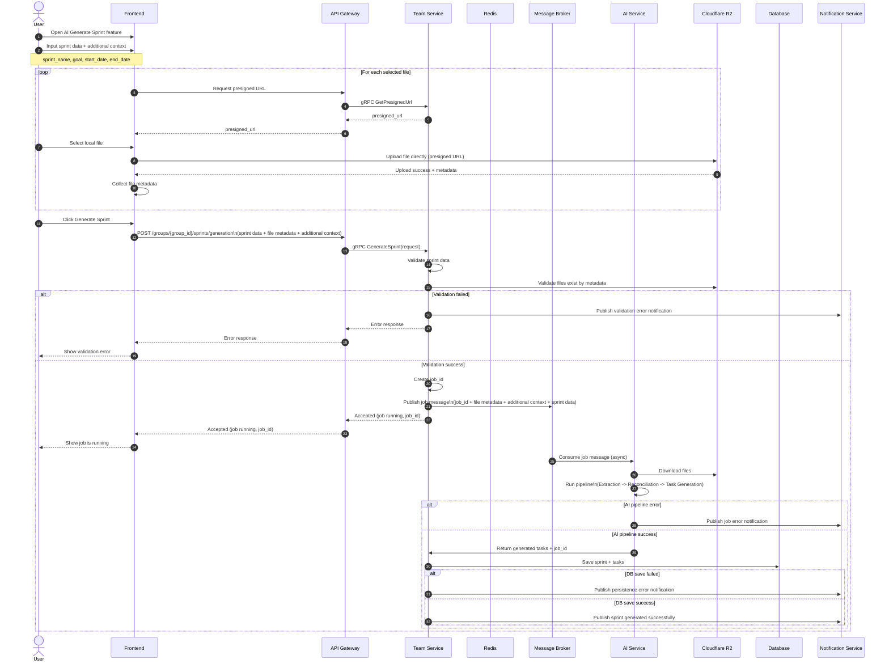

# AI Sprint Generation - Sequence and Validation

## Sequence Diagram



## Validation Checkpoints

| Step | Service | Validation |
| --- | --- | --- |
| Presigned URL | Team Service | user role (Owner/Manager), group membership, valid file request |
| Generate request | Team Service | sprint_name/goal required, start_date <= end_date, file metadata not empty (if files required) |
| File existence | Team Service + R2 | object key exists, upload completed, size/content_type available |
| Job creation | Team Service | unique job_id, payload written successfully |
| AI processing | AI Service | input message schema valid, files downloadable, pipeline stage outputs valid JSON |
| Persistence | Team Service + DB | sprint saved before tasks or in one transaction, rollback on failure |
| Notifications | Notification Service | error/success event contains job_id, group_id, user_id |

---

## Export Sprint Validation Rules

### 1. Quyền hạn thực hiện (Access Control)

| Rule | Response | Comment |
| --- | --- | --- |
| User phải là member của group tương ứng group_id | 403 Forbidden | Re-validate tại Sprint Service, không phụ thuộc Gateway |
| User phải có quyền export (thông qua member role hoặc permissions) | 403 Forbidden | Kiểm tra role/permission trong group_id |

### 2. Xác thực phạm vi (Scope Validation)

| Rule | Response | Comment |
| --- | --- | --- |
| group_id phải tồn tại và chưa bị xóa | 404 Not Found | Kiểm tra trong DB |
| sprint_id phải tồn tại | 404 Not Found | Kiểm tra trong DB |
| Sprint phải thuộc về group_id đang request | 404 Not Found | Verify `sprint.group_id == request.group_id` |

### 3. Xác thực dữ liệu đầu vào (Request Validation)

| Rule | Response | Comment |
| --- | --- | --- |
| group_id phải là UUID hợp lệ | 400 Bad Request | Validate format trước khi query DB |
| sprint_id phải là UUID hợp lệ | 400 Bad Request | Validate format trước khi query DB |

### 4. Ràng buộc dữ liệu Sprint (Sprint Integrity)

| Rule | Response | Comment |
| --- | --- | --- |
| start_date ≤ end_date | 500 Internal Server Error | Detect dữ liệu corrupt |
| Sprint phải có ≥ 1 ngày để render daily columns | 500 Internal Server Error | `(end_date - start_date).days() >= 0` |

### 5. Ràng buộc dữ liệu Task (Task Integrity)

| Rule | Response | Comment |
| --- | --- | --- |
| Task phải thuộc đúng sprint | Skip task (log warning) | Không làm fail toàn bộ export |
| story_point > 0 là hợp lệ, NULL = UNESTIMATED | Skip or include as UNESTIMATED | Tuỳ businesslogic |
| completed_at = NULL → NOT_DONE; completed_at != NULL → DONE | N/A | Logic field, không throw error |
| Task không hợp lệ được bỏ qua, không làm fail process | Log, continue processing | Resilience principle |

### 6. Quy tắc nghiệp vụ (Business Rules)

| Rule | Implication | Comment |
| --- | --- | --- |
| Mỗi task chỉ đóng góp 1 lần tại completed_at | No duplication in daily cells | Chỉ lấy ngày hoàn thành của task, không repeat |
| Không chia nhỏ story point theo nhiều ngày | Each task fills in 1 cell | Cả story point của task được ghi vào 1 ngày |
| Không sử dụng worklog hoặc progress trung gian | Completed_at là single source of truth | Bỏ qua các update trung gian |
| Daily cell fill chỉ khi: completed_at != NULL AND story_point != NULL AND completed_at ∈ [start_date, end_date] | Conditional fill | Nếu không đủ điều kiện → cell rỗng |
| Nếu completed_at > sprint_end → không hiển thị daily columns nhưng vẫn tính vào Spillover | Spillover section | Riêng tracking |

### 7. Tính toán Metrics (Metric Validation)

| Metric | Calculation | Validation |
| --- | --- | --- |
| Total Estimated | SUM(story_point) WHERE story_point != NULL | Chỉ task có story_point |
| Total Completed | COUNT(task) WHERE completed_at != NULL | Chỉ task đã hoàn thành |
| Completion Rate | (Total Completed / Total Estimated) × 100% | If Total Estimated == 0 → set = 0 (no division by zero) |
| Spillover | COUNT(task) WHERE completed_at > sprint_end AND story_point != NULL | Task hoàn thành ngoài sprint |
| Unestimated Count | COUNT(task) WHERE story_point = NULL | Task chưa estimate |

### 8. Ràng buộc Burndown (Consistency Validation)

| Rule | Validation | Comment |
| --- | --- | --- |
| Expected và Actual phải có cùng số lượng ngày | Length(expected) == Length(actual) | Cùng date range |
| Day 0 luôn bằng Total Estimated | expected[0] = actual[0] = Total Estimated | Line trích điểm |
| Actual chỉ giảm khi có task DONE | actual[i] >= actual[i+1] (monotonic non-increasing) | Không được tăng |
| Không có NULL trong burndown arrays | All elements != NULL | Fill zero nếu không có ngày đó |

### 9. Xử lý Edge Case (Edge Case Handling)

| Edge Case | Behavior | Response |
| --- | --- | --- |
| Task chưa hoàn thành (completed_at = NULL) | Không fill daily cells, không ảnh hưởng Actual burndown | Continue |
| Task không có story point (story_point = NULL) | Không tính vào metric, vẫn hiển thị trong bảng | Include in summary, exclude from estimates |
| Task hoàn thành ngoài sprint (completed_at > sprint_end) | Không hiển thị daily, tính vào Total Completed + Spillover | Track separately |
| Sprint không có task | Export file với cấu trúc hợp lệ, burndown flat | OK |
| Sprint có 0 task hoàn thành | Completion Rate = 0%, Actual burndown = flat | OK |
| File size > system limit | Reject export, log warning | 413 Payload Too Large |

### 10. Ràng buộc xuất file (Output Validation)

| Rule | Response | Comment |
| --- | --- | --- |
| File Excel phải được generate thành công, không bị lỗi | 500 Internal Server Error | Catch generation errors |
| Số cột ngày = (end_date - start_date).days() + 1 | 500 if mismatch | Validate after generation |
| File size ≤ system limit (e.g., 50MB) | 413 Payload Too Large | Pre-check quota |
| Content-Type = application/vnd.openxmlformats-officedocument.spreadsheetml.sheet | Validate before responding | Correct MIME type |
| Content-Disposition = attachment; filename=sprint_{sprint_id}.xlsx | Validate before responding | Force download |

---

## Export Sprint Request/Response Contract

### Request
```
GET /groups/{group_id}/sprints/{sprint_id}/export

Path Parameters:
- group_id: UUID (required)
- sprint_id: UUID (required)

Headers:
- Authorization: Bearer <token>
```

### Success Response (200)
```
Status: 200 OK
Content-Type: application/vnd.openxmlformats-officedocument.spreadsheetml.sheet
Content-Disposition: attachment; filename=sprint_<sprint_id>.xlsx
Content-Length: <file_size>

Body: <binary xlsx file>
```

### Error Responses
```
400 Bad Request
- Invalid group_id or sprint_id format

403 Forbidden
- User not member of group
- Insufficient permissions

404 Not Found
- Group not found
- Sprint not found
- Sprint does not belong to group

500 Internal Server Error
- Sprint data integrity error (start_date > end_date, etc.)
- Excel generation failed
- Database unavailable

413 Payload Too Large
- Excel file exceeds size limit
```

---

## AI Sprint Generation Validation Rules

### 1. Quyền hạn thực hiện (Access Control)

| Rule | Response | Comment |
| --- | --- | --- |
| User phải có role Owner hoặc Manager trong group | 403 Forbidden | Re-validate tại Team Service |
| User phải là member của group tương ứng group_id | 403 Forbidden | Check membership trong team.members |
| User không được edit sprint đang được generate (lock status) | 409 Conflict | Prevent race condition |

### 2. Xác thực phạm vi (Scope Validation)

| Rule | Response | Comment |
| --- | --- | --- |
| group_id phải tồn tại và chưa bị xóa | 404 Not Found | Verify in DB |
| Check overlap sprint name trong group (nếu tên trùng) | 409 Conflict | Prevent duplicate sprint name |

### 3. Xác thực dữ liệu đầu vào (Request Validation)

| Rule | Response | Comment |
| --- | --- | --- |
| group_id phải là UUID hợp lệ | 400 Bad Request | Validate format |
| name không rỗng, ≤ 255 char | 400 Bad Request | Required field |
| goal không rỗng, ≤ 1000 char | 400 Bad Request | Required field |
| start_date, end_date phải là ISO 8601 format | 400 Bad Request | Datetime validation |
| additional_context ≤ 2000 char (optional) | 400 Bad Request | Size limit |
| File metadata array không rỗng (ít nhất 1 file) | 400 Bad Request | At least 1 file required |

### 4. Ràng buộc dữ liệu Sprint (Sprint Integrity)

| Rule | Response | Comment |
| --- | --- | --- |
| start_date < end_date (not equal) | 400 Bad Request | Sprint must span > 0 days |
| start_date ≤ today (past or today allowed) | 400 Bad Request | Cannot create future sprint |
| end_date ≥ today (future or today allowed) | 400 Bad Request | Sprint must have end date |
| Sprint duration ≤ max allowed (e.g., 180 days) | 400 Bad Request | Business rule |

### 5. Ràng buộc tệp tin (File Validation)

| Rule | Response | Comment |
| --- | --- | --- |
| File metadata phải chứa: object_key, size | 400 Bad Request | Required fields in metadata |
| object_key phải hợp lệ S3 format | 400 Bad Request | Validate key format |
| Mỗi file phải tồn tại trong R2 (check object head) | 400 Bad Request | File missing from storage |
| File size > 0 và ≤ 4MB per file | 413 Payload Too Large | Size validation |
| Số lượng file ≤ 3 | 400 Bad Request | Max 3 files |  
| Tổng size tất cả files ≤ 12MB | 413 Payload Too Large | Accumulative limit |

### 6. Xác thực dữ liệu từ File (File Content Validation)

| Rule | Response | Comment |
| --- | --- | --- |
| File phải parse thành text thành công | 400 Bad Request | Invalid/corrupt file |
| File text length > 0 | 400 Bad Request | Empty file |
| File text length ≤ max allowed (e.g., 500K chars) | 413 Payload Too Large | Content limit |
| File không chứa binary/null bytes ngoài UTF-8 | 400 Bad Request | Encoding validation |

### 7. Ràng buộc Message Job (Job Management)

| Rule | Response | Comment |
| --- | --- | --- |
| job_id phải unique, không trùng existing job | 500 Internal Server Error | Generate UUID v4 |
| Job payload phải save vào Redis với key=job_id | 500 Internal Server Error | Persistence check |
| Redis TTL ≥ 30 minutes | 500 Internal Server Error | Prevent loss |
| Message phải publish vào Message Broker thành công | 500 Internal Server Error | Async queue delivery |
| Message schema phải hợp lệ JSON | 500 Internal Server Error | Schema validation |

### 8. Ràng buộc AI Pipeline (AI Processing Rules)

| Rule | Response | Comment |
| --- | --- | --- |
| Extraction stage phải produce valid JSON per file | 500 Internal Server Error | Validate with schema |
| Extraction output phải có: features, tasks, user_flows, apis, db_schema (all as arrays) | 500 Internal Server Error | Enforce schema |
| Reconciliation stage input phải là valid normalized items | 500 Internal Server Error | Clustering output check |
| Reconciliation output phải là merged items với title, description, aliases, source, cluster_id | 500 Internal Server Error | Merge validation |
| Task Generation input phải là reconciled normalized data | 500 Internal Server Error | Input format check |
| Task Generation output phải là array of tasks với: name, description, priority, story_point, due_date | 500 Internal Server Error | Output schema check |
| Mỗi stage phải complete hoặc fail (no partial success) | 500 Internal Server Error | All-or-nothing semantics |

### 9. Ràng buộc Output (Generated Tasks Integrity)

| Rule | Response | Comment |
| --- | --- | --- |
| Final tasks array không được rỗng (ít nhất 1 task) | 400 Bad Request | Require minimum output |
| Mỗi task phải có name (≤ 500 char) | 400 Bad Request | Required field |
| Mỗi task phải có description (≤ 2000 char) | 400 Bad Request | Required field |
| priority phải là: LOW, MEDIUM, HIGH, hoặc null | 400 Bad Request | Enum validation |
| story_point phải là: 1, 2, 3, 5, 8 hoặc null | 400 Bad Request | Fibonacci validation |
| due_date phải là null hoặc YYYY-MM-DD format | 400 Bad Request | DateTime validation |
| Tổng tasks ≤ max allowed (e.g., 500 tasks) | 413 Payload Too Large | Resource limit |
| Không có duplicate tasks (by name + description semantic hash) | 400 Bad Request | Dedup validation |

### 10. Ràng buộc Persistence (Database Save)

| Rule | Response | Comment |
| --- | --- | --- |
| Sprint record phải save trước tasks | 500 Internal Server Error | Referential integrity |
| Sprint save phải include: group_id, name, goal, start_date, end_date, status=ACTIVE | 500 Internal Server Error | Completeness check |
| Tất cả tasks phải save thành công hoặc rollback all | 500 Internal Server Error | Transaction consistency |
| Mỗi task phải include: sprint_id, name, description, priority, story_point, status=DRAFT | 500 Internal Server Error | Completeness check |
| Database operation phải complete trong timeout (e.g., 30s) | 500 Internal Server Error (or 504) | Timeout handling |

### 11. Ràng buộc Thông báo (Notification Rules)

| Rule | Response | Comment |
| --- | --- | --- |
| Success notification phải include: title, message | Event published | User notification |
| Error notification phải include: title, message | Event published | User error message |
| Notification phải publish vào Notification Service thành công | 500 Internal Server Error | Delivery check |

### 12. Xử lý Edge Case (Edge Case Handling)

| Edge Case | Behavior | Response |
| --- | --- | --- |
| File extraction produces 0 items | Continue to reconciliation (empty arrays allowed) | OK, fallback to manual entry |
| Reconciliation finds no clusters (single items only) | All items pass through as-is | OK |
| Task generation produces 0 tasks | Fail, require at least 1 task | 400 Bad Request |
| File parse error (e.g., corrupted docx) | Skip file, log error, continue with others if > 1 file; fail if only 1 file | 400 or Skip |
| AI service timeout (> configured timeout) | Fail entire job, publish error notification | 504 Gateway Timeout |
| Redis connection failed | Fail job creation, cannot save job state | 500 Internal Server Error |
| Message Broker connection failed | Fail job submission, cannot enqueue | 500 Internal Server Error |
| Database constraint violation (duplicate sprint name in group) | Fail sprint save, rollback transaction | 409 Conflict or 400 Bad Request |
| Partial success (e.g., sprint saved but tasks failed) | Rollback sprint save, fail entire job | 500 Internal Server Error |
| Empty additional_context | Treat as null, continue processing | OK |
| Large payload (files + context) triggers rate limit | Return 429 Too Many Requests, suggest retry later | 429 |
| Job already exists for same sprint | Return 409 Conflict, suggest waiting or force re-generate | 409 Conflict |

---

## AI Sprint Generation Request/Response Contract

### Request
```
POST /groups/{group_id}/sprints/generation

Path Parameters:
- group_id: UUID (required)

Headers:
- Authorization: Bearer <token>
- Content-Type: application/json

Body:
{
  "name": string (required, max 255),
  "goal": string (required, max 1000),
  "start_date": date (YYYY-MM-DD, required),
  "end_date": date (YYYY-MM-DD, required),
  "additional_context": string (optional, max 2000),
  "files": [
    {
      "object_key": string (required, S3 path),
      "size": number (required, bytes)
    }
  ]
}
```

### Accepted Response (202)
```
Status: 202 Accepted
Content-Type: application/json

Body:
{
  "job_id": UUID,
  "status": "RUNNING",
  "group_id": UUID,
  "sprint_id": UUID (if update mode),
  "message": "Sprint generation in progress",
  "estimated_duration_seconds": number (optional)
}
```

### Error Responses
```
400 Bad Request
- Invalid name or goal format
- Invalid date format or start_date >= end_date
- No files provided
- File metadata missing required fields
- File size > 4MB
- More than 3 files
- Generated tasks empty or invalid schema
- Task deduplication failed

403 Forbidden
- User not member of group
- User lacks Owner/Manager role

404 Not Found
- Group not found
- File not found in R2

409 Conflict
- Sprint name already exists in group
- Job already running for same sprint
- User lacks write permission

413 Payload Too Large
- Single file exceeds 4MB
- Total file size exceeds 12MB
- Generated tasks exceed limit

429 Too Many Requests
- Rate limit triggered (large payload)

500 Internal Server Error
- Redis save failed
- Message Broker publish failed
- Database transaction failed
- AI service internal error
- Sprint integrity error (corrupt data)

504 Gateway Timeout
- AI service timeout
- Database operation timeout
```

